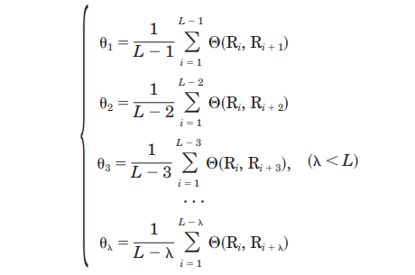
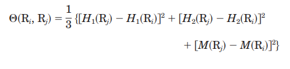
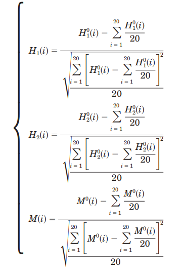
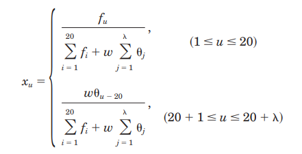

# Prediction-of-Protein-Cellular-Attributes-Using-Pseudo--Amino-Acid-Composition
## Introduction
The cellular attributes of a protein, such as which compartment of a cell it belongs to and how it is associated with the lipid bilayer of an organelle, are closely correlated with its biological functions. The existing algorithms for predicting these attributes were all based on the amino acid composition in which no sequence order effect was taken into account. So, here we developed a way of representation through which we can also embed the sequence order effect. The number of different combinations for a protein of 364 residues will be 20364>> 1.1259X1065! For such a huge number, it is impractical to construct a training data set to statistically cover all possible samples based on the current protein data. Furthermore, protein sequence lengths vary widely. This has posed an additional difficulty for including sequence order information, in both constructing a training data set and formulating an algorithm.
## THE PSEUDO-AMINO ACID COMPOSITION
We have already seen that incorporating so much variation in the statistical model is tough, but what if we can take this effect into account using a small set of numbers that’s what pseudo amino acid composition does.             
The conventional amino acid composition contains 20 components, or discrete numbers, each reflecting the occurrence frequency of one of the 20 native amino acids in a protein.
Here we also have some extra values; let’s say “x” values, which encodes the sequence effect in them. 
To calculate these “x” values consider a protein chain of L amino acid residues:         
<pre>                                 R1R2R3R4.........RL                                 ------ (1)</pre>                              
And let the corelative factors be theta1 , theta2, .......,olambda then -                         
                                      
Here the function relating two amino acid residues can be represented as 
                             
Where H1(Ri), H2(Ri), M(Ri) represents hydrophobicity, hydrophilicity and Mass of the chain. Note that we can also incorporate some other properties here, which is also an advantage of this approach. Note that before
substituting the values of hydrophobicity, hydrophilicity, and side chain mass into Eq. 3, they were all be normalised first, as given below.                                 
                    
                       
Now lets say we have our feature vector be X={x1,x2,.......,x20,.......x20+lambda} then we will follow below given formulas for feature vector representation which is just a normalisation step.                 
          
                               
A set of such 20+labda components as formulated by Eqs. 5 and 6 is called the pseudo-amino acid composition for protein X. This representation beats other available representations and gives better results on previously available functions.
                                
## THE PREDICTION ALGORITHMS
Let's say S be set of all available proteins in the training set, and there are m subsets, the union of which gives S. We have to classify a given new protein in these m categories. For which we will first calculate feature vector for all proteins in the dataset and then cluster them accordingly in the subsets after that we calculate mean of all these feature vector to give Xmuniversal, which will then represent a particular subset and the universal vector whom over new feature vector resembles the most is our subset class. To calculate this resemblance we have several functions which can calculate the relativity of two vectors -                        
1.The least Hamming distance - Which is equal to the absolute value of the difference between two vectors.
2. The least euclidean distance algorithm - Simply summation of square of the difference between two vectors and one with minimum distance gives the subset class.                          
3. The ProtLock Algorithm - Where we matrix mapping to calculate resemblance.                                   
4. The Covariant Discriminant - Instead of geometrical distance, in the covariant discriminant algorithm, a function was used as a scale to measure the similarity between proteins.                                                     

## RESULTS AND DISCUSSION
As per the experiments, always outperform older feature representation using the same function as they are using, which shows the dominance of this approach. The best performing method is covariant discriminant because of its ability to show resemblance quite accurately.The three main contributions of this work are -                                                                           
1) It contains more sequence order affects not only than the 20-D conventional amino acid composition but also than the 210-D pair-coupled amino acid composition and the 400-D first-order coupled amino acid-composition, as reflected by a series of sequence correlation factors with different tiers of correlation.                                                                           
2) These factors are defined by a correlation function that allows users to introduce any other biochemical quantities (in addition to the hydrophobicity, hydrophilicity, and sidechain mass as explicitly expressed in Eq. 3) to obtain the optimal results for various cases concerned.                                                                           
3) The pseudoamino acid composition has the same formulation as the conventional one except containing more components (discrete numbers); accordingly, all the existing prediction algorithms based on the conventional amino acid composition can be straightforwardly extended to cover the pseudoamino acid composition.

